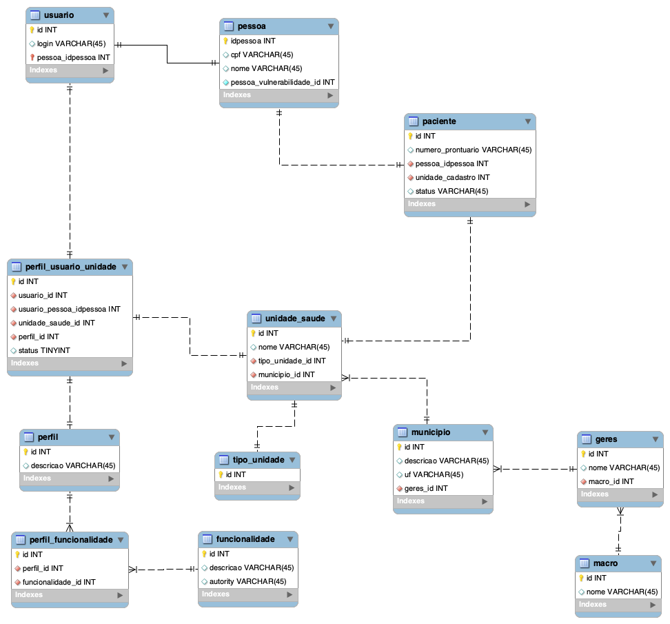

# 🚀 STARTER  
**Starter JSF - SES/PE**

---

## 👨‍💻 Autores  
- **Hudson Alves Moreno**
- **Luiz Henrique**
- **Renato Gomes**

---

## 🧰 Tecnologias Utilizadas  
- ☕ **Java JDK 21**  
- 🌱 **Spring Boot 3.2.4**  
- 📦 **Maven 4.0.0**  
- 🐘 **PostgreSQL 16**  
- 🎭 **JSF 4.0**  
- 🤝 **JoinFaces 5.4.0**  
- 🎨 **PrimeFaces 14**  
- 🧾 **JasperReports 6.17**  
- 🔄 **FlyWay**

---

## ⚙️ Configuração  

A aplicação possui **3 profiles** configurados.  
🔧 O **perfil `local`** é habilitado por padrão.

### 🧩 O que são Profiles no Spring?

Os **profiles** no Spring Boot são uma forma de **isolar configurações específicas para diferentes ambientes**, como:

- 🧪 `local` – ambiente de desenvolvimento na máquina do desenvolvedor  
- 🧷 `hml` – ambiente de homologação para testes de aceitação  
- 🚀 `prod` – ambiente de produção, com configurações seguras e otimizadas

Cada profile pode definir propriedades distintas em arquivos como:

```
application-local.properties  
application-hml.properties  
application-prod.properties
```

Você pode ativar o profile desejado de três formas:

- No `application.properties`:
  ```
  spring.profiles.active=local
  ```

- Via linha de comando:
  ```
  java -jar app.jar --spring.profiles.active=prod
  ```

- Em variáveis de ambiente, útil para servidores e containers.

> Isso permite adaptar a aplicação facilmente para diferentes contextos, sem alterar o código-fonte.


---

### 🛠️ Maven  

> Clique com o botão direito no projeto → **Maven** → **Update Project**

---

### 📚 JoinFaces
📄 Acesse a documentação oficial do **JoinFaces 5.4.x**:  
🔗 [Documentação JoinFaces 5.4.x](https://docs.joinfaces.org/5.4.x/reference/)

> Esta documentação cobre toda a configuração e uso do JoinFaces com Spring Boot e JSF 4.

---

### 📚 Primefaces 14 
📄 Acesse a documentação oficial do **Primefaces 14**:  
🔗 [Documentação Primefaces 14](https://primefaces.github.io/primefaces/14_0_0/#/)

> Esta documentação cobre toda a configuração e uso do Primefaces 14.

---

### 🎨 Template Utilizado – PrimeFaces Ultima

Este projeto utiliza o **PrimeFaces Ultima 7.0**, um moderno e responsivo **template premium** para aplicações JSF.

🔗 Acesse o site oficial do template para visualizar o layout e os componentes disponíveis:  
👉 [https://www.primefaces.org/ultima/](https://www.primefaces.org/ultima/)

> O Ultima oferece uma interface rica, adaptável e pronta para dispositivos móveis, sendo ideal para aplicações administrativas e corporativas.


### 🚦 Iniciar Projeto  

1. 🐘 No **PostgreSQL 16**, crie um banco chamado `starter`.  
2. ✏️ Edite o `application.properties` com suas credenciais.  
3. ▶️ Inicie a aplicação. Ela estará disponível na **porta 8080**.  
4. 🛫 **Primeira execução:** ao subir a aplicação pela primeira vez, o **Flyway** será executado automaticamente, **criando e populando todas as tabelas necessárias** para o funcionamento inicial do sistema, inclusive dados essenciais para importações e testes.


---

### 🔐 Dados de Acesso

```
Login: estomia.admin
Senha: Tasemsenha2017
```

---
### 🧩 Modelagem



### 📦 Geração do Artefato para Produção  

Use o seguinte comando:

```
mvn clean install -P prod
```
---

### 🕵️ Auditoria com Hibernate Envers  

Este projeto utiliza o **Hibernate Envers** para realizar **auditoria automática** das entidades JPA.

🔍 O Envers permite manter um **histórico completo de alterações** feitas em registros do banco de dados, incluindo:

- Criação, atualização e exclusão de dados;
- Registro de **quem alterou**, **quando alterou** e **qual o valor anterior**;
- Acesso às revisões de uma entidade ao longo do tempo.

> Essa funcionalidade é essencial para **rastreabilidade**, **transparência** e **conformidade** com boas práticas de segurança da informação e controle de dados sensíveis.

